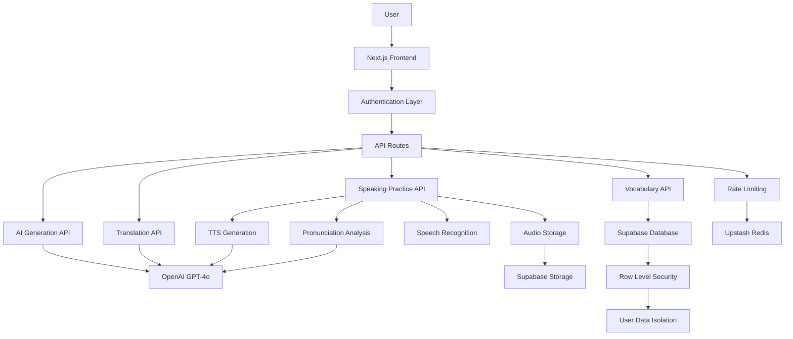

# LearnThaiAI - Technical Architecture Guide

> **For setup instructions and user features, see [README.md](README.md)**

This document provides comprehensive technical documentation for developers, architects, and contributors who need to understand the system's internal architecture and implementation details.

## 🎯 System Overview

### **Platform Summary**

- **Type**: Full-stack web application
- **Framework**: Next.js 15 with TypeScript
- **Architecture**: JAMstack (Static + Serverless API)
- **Target**: Thai language learners of all levels
- **Core Innovation**: AI-enhanced spaced repetition learning

### **Technology Stack**

```
┌─ Frontend (Client-Side) ─────────────────────┐
│ • Next.js 15 (React 19 + App Router)        │
│ • TypeScript 5 (Full type safety)           │
│ • TailwindCSS 3.4 (Utility-first styling)   │
│ • shadcn/ui + Radix UI (Accessible components) │
│ • next-themes (Theme management)             │
│ • OpenAI Whisper API (Speech transcription)  │
│ • MediaRecorder API (Audio recording)       │
└─────────────────────────────────────────────┘

┌─ Backend (Server-Side) ──────────────────────┐
│ • Next.js API Routes (Serverless functions)  │
│ • Supabase (PostgreSQL + Auth + RLS + Storage) │
│ • OpenAI GPT-4o (AI language generation)     │
│ • OpenAI TTS (Text-to-speech synthesis)      │
│ • Upstash Redis (Rate limiting & caching)    │
│ • Zod (Runtime schema validation)            │
└─────────────────────────────────────────────┘

┌─ Infrastructure ─────────────────────────────┐
│ • Vercel (Hosting + CDN + Edge Functions)    │
│ • Supabase Cloud (Managed database + storage) │
│ • OpenAI API (Language model + TTS service)  │
│ • Upstash (Global Redis cache)               │
└─────────────────────────────────────────────┘
```

## 🏗️ System Architecture

### **Application Flow**



### **Data Flow Architecture**

1. **User Authentication**: Supabase Auth with JWT tokens
2. **Request Validation**: Zod schemas + middleware
3. **Rate Limiting**: Redis-based protection
4. **AI Processing**: OpenAI API integration
5. **Data Persistence**: PostgreSQL with RLS
6. **Response Optimization**: Caching + compression

## 💾 Database Architecture

### **Core Schema (PostgreSQL)**

```sql
-- User vocabulary with SM-2 spaced repetition
CREATE TABLE vocabulary (
  id UUID PRIMARY KEY DEFAULT gen_random_uuid(),
  user_id UUID REFERENCES auth.users(id) ON DELETE CASCADE,

  -- Thai word data
  word TEXT NOT NULL,
  word_romanization TEXT,
  translation TEXT NOT NULL,
  sentence TEXT NOT NULL,
  sentence_romanization TEXT,
  sentence_translation TEXT,

  -- Learning status tracking
  status TEXT DEFAULT 'new' CHECK (status IN ('new', 'learning', 'mastered')),

  -- SM-2 Algorithm implementation
  interval INTEGER DEFAULT 1,              -- Days until next review
  ease_factor DECIMAL(4,2) DEFAULT 2.5,    -- Learning difficulty (1.3-3.0+)
  repetitions INTEGER DEFAULT 0,            -- Successful review count
  next_review TIMESTAMP WITH TIME ZONE DEFAULT NOW(),

  -- Audit fields
  created_at TIMESTAMP WITH TIME ZONE DEFAULT NOW(),
  updated_at TIMESTAMP WITH TIME ZONE DEFAULT NOW()
);

-- TTS Audio caching system
CREATE TABLE cached_audio (
  id UUID PRIMARY KEY DEFAULT gen_random_uuid(),
  text_hash TEXT UNIQUE NOT NULL,
  text_content TEXT NOT NULL,
  voice_name TEXT NOT NULL,
  audio_type TEXT NOT NULL DEFAULT 'reference' CHECK (audio_type IN ('reference', 'user')),
  content_type TEXT NOT NULL DEFAULT 'sentence' CHECK (content_type IN ('word', 'sentence')),
  storage_path TEXT NOT NULL,
  file_size INTEGER NOT NULL,
  created_at TIMESTAMP WITH TIME ZONE DEFAULT NOW()
);

-- Speaking practice sessions tracking
CREATE TABLE pronunciation_sessions (
  id UUID PRIMARY KEY DEFAULT gen_random_uuid(),
  user_id UUID REFERENCES auth.users(id) ON DELETE CASCADE,
  vocabulary_id UUID REFERENCES vocabulary(id) ON DELETE CASCADE,
  practice_mode TEXT NOT NULL CHECK (practice_mode IN ('word', 'sentence')),
  target_text TEXT NOT NULL,
  transcribed_text TEXT,
  feedback_data JSONB,
  score INTEGER CHECK (score >= 0 AND score <= 100),
  created_at TIMESTAMP WITH TIME ZONE DEFAULT NOW()
);

-- Performance optimization indexes
CREATE INDEX idx_vocabulary_user_review ON vocabulary(user_id, next_review);
CREATE INDEX idx_vocabulary_status ON vocabulary(user_id, status);
CREATE INDEX idx_vocabulary_created ON vocabulary(user_id, created_at DESC);
CREATE INDEX idx_cached_audio_text_hash ON cached_audio(text_hash);
CREATE INDEX idx_cached_audio_type ON cached_audio(audio_type, content_type);
CREATE INDEX idx_pronunciation_sessions_user_id ON pronunciation_sessions(user_id);
```

### **Row Level Security (RLS)**

```sql
-- Users can only access their own vocabulary
CREATE POLICY "Users can only access own vocabulary" ON vocabulary
  FOR ALL USING (auth.uid() = user_id);

-- Prevent data leakage between users
ALTER TABLE vocabulary ENABLE ROW LEVEL SECURITY;
```

### **Audio Storage Architecture**

```sql
-- Dual bucket strategy for audio files
INSERT INTO storage.buckets (id, name, public, file_size_limit, allowed_mime_types)
VALUES
  -- Shared TTS cache (reference audio)
  ('audio-cache', 'audio-cache', false, 52428800,
   ARRAY['audio/webm', 'audio/mp3', 'audio/wav', 'audio/mpeg', 'audio/mp4']),

  -- User-specific recordings (temporary)
  ('user-recordings', 'user-recordings', false, 10485760,
   ARRAY['audio/webm', 'audio/mp3', 'audio/wav', 'audio/mpeg']);

-- Storage RLS policies for secure access
CREATE POLICY "authenticated_read_cached_audio" ON storage.objects
FOR SELECT USING (bucket_id = 'audio-cache' AND auth.role() = 'authenticated');

CREATE POLICY "user_read_own_recordings" ON storage.objects
FOR SELECT USING (
  bucket_id = 'user-recordings' AND
  auth.role() = 'authenticated' AND
  (storage.foldername(name))[1] = auth.uid()::text
);
```

## 🧠 AI Integration Architecture

### **OpenAI GPT-4o Integration**

**Vocabulary Generation Pipeline:**

```typescript
interface VocabularyGeneration {
  // Input validation
  topic: string // User-provided topic
  excludeWords: string[] // Previously learned words

  // GPT-4o processing
  prompt: string // Engineered prompt
  response: AIResponse // Structured JSON response

  // Post-processing
  validation: boolean // Zod schema validation
  filtering: string[] // Duplicate/inappropriate content removal

  // Output
  vocabulary: VocabularyWord[]
}
```

**Prompt Engineering Strategy:**

```typescript
const generateVocabularyPrompt = (topic: string, excludeWords: string[]) => `
Generate exactly 10 Thai vocabulary words related to: "${topic}"

Requirements:
- Focus on practical, commonly used words
- Include romanization using Royal Thai system
- Provide natural, conversational example sentences
- Avoid these previously learned words: ${excludeWords.join(", ")}

Return JSON array with this exact structure:
[{
  "word": "Thai word",
  "romanization": "phonetic spelling",
  "translation": "English meaning",
  "sentence": "Thai example sentence",
  "sentence_romanization": "romanized sentence",
  "sentence_translation": "English translation"
}]
`
```

### **Translation Service Architecture**

```typescript
interface TranslationService {
  // Bidirectional translation
  translateToThai(english: string): Promise<ThaiTranslation>;
  translateToEnglish(thai: string): Promise<EnglishTranslation>;

  // Response structure
  interface ThaiTranslation {
    thai: string;
    romanization: string;
    confidence: number;
  }

  interface EnglishTranslation {
    english: string;
    explanation?: string;
    confidence: number;
  }
}
```

## 📚 Spaced Repetition Engine

### **SM-2 Algorithm Implementation**

```typescript
class SpacedRepetitionEngine {
  /**
   * Calculate next review interval based on SM-2 algorithm
   * @param ease_factor Current difficulty (1.3-3.0+)
   * @param repetitions Number of successful reviews
   * @param rating User performance rating (0-5)
   */
  calculateNextInterval(
    ease_factor: number,
    repetitions: number,
    rating: number
  ): {
    interval: number
    newEaseFactor: number
    newRepetitions: number
  } {
    // Algorithm implementation
    let newEaseFactor = ease_factor
    let newRepetitions = repetitions
    let interval = 1

    if (rating >= 3) {
      // Successful recall
      newRepetitions += 1

      if (newRepetitions === 1) {
        interval = 1
      } else if (newRepetitions === 2) {
        interval = 6
      } else {
        interval = Math.round(interval * ease_factor)
      }
    } else {
      // Failed recall - restart
      newRepetitions = 0
      interval = 1
    }

    // Adjust ease factor based on performance
    newEaseFactor = Math.max(
      1.3,
      ease_factor + (0.1 - (5 - rating) * (0.08 + (5 - rating) * 0.02))
    )

    return { interval, newEaseFactor, newRepetitions }
  }
}
```

### **Priority Scoring System**

```typescript
interface PriorityScore {
  /**
   * Calculate review priority (0-100 points)
   * Higher score = higher priority for review
   */
  calculatePriority(word: VocabularyWord): number {
    const now = new Date();
    const nextReview = new Date(word.next_review);
    const daysSinceCreated = (now.getTime() - word.created_at.getTime()) / (1000 * 60 * 60 * 24);
    const daysOverdue = Math.max(0, (now.getTime() - nextReview.getTime()) / (1000 * 60 * 60 * 24));

    let priority = 0;

    // Difficulty factor (0-30 points) - lower ease = higher priority
    priority += Math.max(0, 30 - (word.ease_factor - 1.3) * 15);

    // Learning efficiency (0-25 points) - low repetitions vs time = higher priority
    const efficiency = word.repetitions / Math.max(1, daysSinceCreated);
    priority += Math.max(0, 25 - efficiency * 25);

    // Status priority (0-20 points)
    const statusPriority = {
      'new': 20,
      'learning': 15,
      'mastered': 5
    };
    priority += statusPriority[word.status] || 0;

    // Overdue bonus (0-15 points)
    priority += Math.min(15, daysOverdue * 2);

    // Interval adjustment (0-10 points) - shorter intervals = higher priority
    priority += Math.max(0, 10 - word.interval * 0.5);

    return Math.min(100, Math.round(priority));
  }
}
```

## 🎤 Speaking Practice System Architecture

### **TTS Audio Caching System**

```typescript
interface AudioCacheSystem {
  // Cache key generation
  generateCacheKey(text: string, audioType: 'reference' | 'user', contentType: 'word' | 'sentence'): string;

  // Cache management
  getCachedAudio(cacheKey: string): Promise<Buffer | null>;
  setCachedAudio(cacheKey: string, audioBuffer: Buffer, metadata: AudioMetadata): Promise<void>;

  // Cost optimization strategy
  interface CostStrategy {
    referenceAudio: 'cache'; // Always cache reference pronunciations
    userTranscriptions: 'never_cache'; // Never cache user-generated content
    maxCacheAge: 30; // days
    compression: 'webm'; // Efficient codec
  }
}

// Implementation example
class AudioCacheManager {
  async generateTTS(
    text: string,
    audioType: 'reference' | 'user',
    contentType: 'word' | 'sentence'
  ): Promise<Buffer> {
    const cacheKey = this.generateCacheKey(text, audioType, contentType);

    // Only check cache for reference audio
    if (audioType === 'reference') {
      const cached = await this.getCachedAudio(cacheKey);
      if (cached) return cached;
    }

    // Generate new audio via OpenAI TTS
    const audioBuffer = await this.generateWithOpenAI(text);

    // Cache reference audio only
    if (audioType === 'reference') {
      await this.setCachedAudio(cacheKey, audioBuffer, {
        text,
        audioType,
        contentType,
        voiceName: 'nova'
      });
    }

    return audioBuffer;
  }
}
```

### **Speech Recognition Pipeline**

```typescript
interface SpeechRecognitionPipeline {
  // OpenAI Whisper-based speech transcription
  recordAudio(): Promise<Blob>
  transcribeAudio(audioBlob: Blob): Promise<string>

  // AI-powered pronunciation analysis
  analyzePronunciation(
    userTranscription: string,
    targetText: string,
    targetRomanization: string
  ): Promise<PronunciationFeedback>
}

interface PronunciationFeedback {
  transcribed: string
  mistakes: string[]
  tip: string
  corrected: {
    thai: string
    romanization: string
    translation: string
  }
  confidence: number
}

// Implementation flow
class SpeakingPracticeEngine {
  async processPronunciationAttempt(
    audioBlob: Blob,
    targetSentence: {
      thai: string
      romanization: string
      translation: string
    }
  ): Promise<PronunciationFeedback> {
    // 1. Transcribe user audio using OpenAI Whisper (GPT-4o mini)
    const userTranscription = await this.transcribeAudio(audioBlob)

    // 2. Analyze pronunciation using GPT-4o
    const feedback = await this.analyzePronunciation(
      userTranscription,
      targetSentence.thai,
      targetSentence.romanization
    )

    // 3. Store session data for analytics
    await this.storePronunciationSession({
      targetText: targetSentence.thai,
      transcribedText: userTranscription,
      feedbackData: feedback,
    })

    return feedback
  }
}
```

### **Speech-to-Text Architecture Decision**

The platform uses OpenAI's Whisper API with the `gpt-4o-mini-transcribe` model for speech-to-text transcription instead of browser-based Web Speech API for several key reasons:

- **Multi-browser Compatibility**: Works consistently across all browsers and devices
- **Thai Language Optimization**: Better accuracy for Thai pronunciation and tones
- **Privacy-First**: Audio processed server-side, never cached or stored permanently
- **Cost Efficiency**: Mini model provides excellent accuracy at low cost
- **Reliability**: Eliminates browser-specific STT inconsistencies

### **Audio Comparison System**

```typescript
interface AudioComparisonSystem {
  // Generate comparison audio using same TTS voice
  generateUserAudio(transcribedText: string): Promise<Buffer>;
  generateReferenceAudio(targetText: string): Promise<Buffer>;

  // Audio playback coordination
  interface AudioControls {
    playUserVersion(): Promise<void>;
    playCorrectVersion(): Promise<void>;
    stopAll(): void;
  }
}

// Cost-optimized implementation
class AudioComparisonManager {
  async generateComparisonAudio(
    userTranscription: string,
    targetText: string,
    practiceMode: 'word' | 'sentence'
  ): Promise<{
    userAudio: Buffer;
    referenceAudio: Buffer;
  }> {
    // Generate both using same TTS voice for fair comparison
    const [userAudio, referenceAudio] = await Promise.all([
      this.ttsService.generate(userTranscription, 'user', practiceMode),
      this.ttsService.generate(targetText, 'reference', practiceMode)
    ]);

    return { userAudio, referenceAudio };
  }
}
```

### **GPT-4o Pronunciation Analysis**

```typescript
const analyzePronunciationPrompt = (
  userTranscription: string,
  targetThai: string,
  targetRomanization: string,
  targetTranslation: string
) => `
Analyze this Thai pronunciation attempt:

Target: "${targetThai}" (${targetRomanization}) - "${targetTranslation}"
User said: "${userTranscription}"

Provide detailed feedback in this JSON format:
{
  "transcribed": "what the user actually said",
  "mistakes": ["specific pronunciation errors"],
  "tip": "helpful pronunciation advice",
  "corrected": {
    "thai": "corrected version if needed",
    "romanization": "corrected romanization",
    "translation": "corrected translation"
  }
}

Focus on:
- Tone differences (Thai has 5 tones)
- Consonant/vowel pronunciation
- Word boundaries and rhythm
- Cultural context if relevant
`

class PronunciationAnalyzer {
  async analyze(
    userTranscription: string,
    target: { thai: string; romanization: string; translation: string }
  ): Promise<PronunciationFeedback> {
    const response = await this.openai.chat.completions.create({
      model: "gpt-4o-mini",
      messages: [
        {
          role: "user",
          content: analyzePronunciationPrompt(
            userTranscription,
            target.thai,
            target.romanization,
            target.translation
          ),
        },
      ],
      temperature: 0.3, // Lower temperature for consistent analysis
      response_format: { type: "json_object" },
    })

    return JSON.parse(response.choices[0].message.content)
  }
}
```

### **Storage Optimization Strategy**

```typescript
interface StorageOptimization {
  // Cache strategy
  cachePolicy: {
    referenceAudio: 'permanent_cache'; // Shared across all users
    userTranscriptions: 'temporary'; // 7-day TTL
    maxFileSize: 10485760; // 10MB for recordings
    compressionFormat: 'webm'; // Browser-native, efficient
  };

  // Cost management
  costOptimization: {
    ttsCostPerCharacter: 0.000015; // OpenAI TTS pricing
    cacheHitRate: 85; // % of requests served from cache
    estimatedMonthlySavings: 40; // % cost reduction
  };

  // Cleanup automation
  cleanupStrategy: {
    oldCacheEntries: '30 days';
    userRecordings: '7 days';
    scheduledCleanup: 'weekly';
  };
}

// Automated cleanup functions
CREATE OR REPLACE FUNCTION cleanup_old_cached_audio()
RETURNS INTEGER AS $$
DECLARE
  deleted_count INTEGER;
BEGIN
  DELETE FROM cached_audio
  WHERE created_at < NOW() - INTERVAL '30 days';

  GET DIAGNOSTICS deleted_count = ROW_COUNT;
  RETURN deleted_count;
END;
$$ LANGUAGE plpgsql SECURITY DEFINER;
```

## 🔒 Security Architecture

### **Authentication & Authorization**

```typescript
// JWT token validation middleware
export const withAuth = (handler: AuthenticatedHandler) => {
  return async (req: NextRequest) => {
    try {
      // Extract and validate JWT token
      const token = req.headers.get("Authorization")?.replace("Bearer ", "")
      if (!token) {
        return Response.json(
          { error: "Missing authentication token" },
          { status: 401 }
        )
      }

      // Verify token with Supabase
      const {
        data: { user },
        error,
      } = await supabase.auth.getUser(token)
      if (error || !user) {
        return Response.json({ error: "Invalid token" }, { status: 401 })
      }

      // Call authenticated handler
      return handler(req, user)
    } catch (error) {
      return Response.json({ error: "Authentication failed" }, { status: 401 })
    }
  }
}
```

### **Rate Limiting Implementation**

```typescript
// Redis-based rate limiting
export class RateLimiter {
  private redis: Redis

  constructor() {
    this.redis = new Redis({
      url: process.env.UPSTASH_REDIS_REST_URL,
      token: process.env.UPSTASH_REDIS_REST_TOKEN,
    })
  }

  async checkLimit(userId: string, endpoint: string): Promise<boolean> {
    const key = `rate_limit:${userId}:${endpoint}`
    const limit = this.getLimitForEndpoint(endpoint)

    // Sliding window algorithm
    const current = await this.redis.incr(key)

    if (current === 1) {
      await this.redis.expire(key, 3600) // 1 hour window
    }

    return current <= limit
  }

  private getLimitForEndpoint(endpoint: string): number {
    const limits = {
      vocabulary: 100, // 100 requests/hour
      generation: 20, // 20 requests/hour
      translation: 50, // 50 requests/hour
    }

    return limits[endpoint] || 60 // Default limit
  }
}
```

### **Input Validation with Zod**

```typescript
// Type-safe validation schemas
export const vocabularySchema = z.object({
  word: z.string().min(1).max(100),
  word_romanization: z.string().optional(),
  translation: z.string().min(1).max(500),
  sentence: z.string().min(1).max(1000),
  sentence_romanization: z.string().optional(),
  sentence_translation: z.string().min(1).max(1000),
})

export const generateVocabSchema = z.object({
  topic: z.string().min(3).max(200),
})

export const rateVocabSchema = z.object({
  id: z.string().uuid(),
  rating: z.number().min(0).max(5),
})
```

## 🎨 Frontend Architecture

### **Component Organization Strategy**

```
src/components/
├── shared/              # Cross-application components
│   ├── ProtectedRoute.tsx      # Authentication wrapper
│   ├── SidebarLayout.tsx       # Navigation layout
│   ├── theme-provider.tsx      # Theme context
│   └── theme-toggle.tsx        # Dark/light mode toggle
├── review/              # Review page components
│   ├── BrowseVocabulary.tsx    # Vocabulary browsing
│   ├── DeleteConfirmationModal.tsx  # Deletion confirmation
│   ├── PriorityModeSelector.tsx     # Review mode selection
│   ├── ReviewSession.tsx            # Active review session
│   └── SessionStats.tsx             # Review statistics
├── topic/               # Topic generation components
│   └── vocabulary-loading.tsx      # AI generation loading
└── ui/                  # shadcn/ui primitives
    ├── button.tsx
    ├── card.tsx
    ├── input.tsx
    └── ...
```

### **State Management Pattern**

```typescript
// Context-based global state
interface AuthContextType {
  user: User | null
  loading: boolean
  signIn: (email: string, password: string) => Promise<void>
  signOut: () => Promise<void>
  signUp: (email: string, password: string) => Promise<void>
}

export const AuthContext = createContext<AuthContextType | undefined>(undefined)

// Custom hook for auth state
export const useAuth = () => {
  const context = useContext(AuthContext)
  if (!context) {
    throw new Error("useAuth must be used within AuthProvider")
  }
  return context
}
```

### **Theme System Implementation**

```typescript
// CSS custom properties for theme switching
const themeConfig = {
  light: {
    "--background": "0 0% 100%",
    "--foreground": "240 10% 3.9%",
    "--primary": "240 5.9% 10%",
    "--secondary": "240 4.8% 95.9%",
    "--muted": "240 4.8% 95.9%",
    "--accent": "240 4.8% 95.9%",
    "--destructive": "0 72.2% 50.6%",
  },
  dark: {
    "--background": "240 10% 3.9%",
    "--foreground": "0 0% 98%",
    "--primary": "0 0% 98%",
    "--secondary": "240 3.7% 15.9%",
    "--muted": "240 3.7% 15.9%",
    "--accent": "240 3.7% 15.9%",
    "--destructive": "0 62.8% 30.6%",
  },
}
```

## 🚀 Performance Optimization

### **Frontend Optimizations**

```typescript
// Code splitting and lazy loading
const ReviewSession = lazy(() => import("./components/review/ReviewSession"))
const BrowseVocabulary = lazy(
  () => import("./components/review/BrowseVocabulary")
)

// Memoization for expensive calculations
const PriorityScore = memo(({ word }: { word: VocabularyWord }) => {
  const score = useMemo(() => calculatePriority(word), [word])
  return <div>Priority: {score}</div>
})

// Optimized database queries
const getVocabularyDue = async (userId: string, mode: "priority" | "time") => {
  const baseQuery = supabase
    .from("vocabulary")
    .select("*")
    .eq("user_id", userId)
    .lte("next_review", new Date().toISOString())

  if (mode === "priority") {
    // Complex priority sorting done in application
    const { data } = await baseQuery
    return data?.sort((a, b) => calculatePriority(b) - calculatePriority(a))
  } else {
    // Simple time-based sorting in database
    return baseQuery.order("next_review", { ascending: true })
  }
}
```

### **Backend Optimizations**

```typescript
// Response caching with Redis
export const withCache = (handler: Handler, ttl: number = 3600) => {
  return async (req: NextRequest, user: User) => {
    const cacheKey = `cache:${user.id}:${req.url}`

    // Check cache first
    const cached = await redis.get(cacheKey)
    if (cached) {
      return Response.json(JSON.parse(cached))
    }

    // Execute handler
    const response = await handler(req, user)
    const data = await response.json()

    // Cache successful responses
    if (response.status === 200) {
      await redis.setex(cacheKey, ttl, JSON.stringify(data))
    }

    return Response.json(data, { status: response.status })
  }
}
```

## 📊 Analytics & Monitoring

### **Learning Analytics**

```typescript
interface LearningMetrics {
  // User progress tracking
  totalWords: number
  wordsLearning: number
  wordsMastered: number

  // Review performance
  dailyReviews: number
  weeklyReviews: number
  averageRating: number

  // Efficiency metrics
  learningVelocity: number // Words mastered per day
  retentionRate: number // % of reviews with rating >= 3
  difficultyTrend: number // Average ease factor change
}

// Track learning events
export const trackLearningEvent = async (
  userId: string,
  event: "word_generated" | "review_completed" | "word_mastered",
  metadata?: Record<string, any>
) => {
  await supabase.from("learning_events").insert({
    user_id: userId,
    event_type: event,
    metadata,
    timestamp: new Date(),
  })
}
```

### **System Monitoring**

```typescript
// API performance monitoring
export const withMonitoring = (handler: Handler) => {
  return async (req: NextRequest, user: User) => {
    const startTime = Date.now()

    try {
      const response = await handler(req, user)

      // Log successful requests
      console.log({
        endpoint: req.url,
        method: req.method,
        userId: user.id,
        duration: Date.now() - startTime,
        status: response.status,
      })

      return response
    } catch (error) {
      // Log errors
      console.error({
        endpoint: req.url,
        method: req.method,
        userId: user.id,
        duration: Date.now() - startTime,
        error: error.message,
      })

      throw error
    }
  }
}
```

## 🔧 Development Workflow

### **Code Quality Standards**

```json
{
  "scripts": {
    "lint": "next lint --strict",
    "type-check": "tsc --noEmit --strict",
    "format": "prettier --write . --ignore-path .gitignore",
    "test": "jest --coverage",
    "test:watch": "jest --watch",
    "build": "next build",
    "analyze": "ANALYZE=true npm run build"
  },
  "husky": {
    "hooks": {
      "pre-commit": "lint-staged",
      "pre-push": "npm run type-check && npm run test"
    }
  }
}
```

### **Deployment Pipeline**

```yaml
# .github/workflows/deploy.yml
name: Deploy to Production

on:
  push:
    branches: [main]

jobs:
  deploy:
    runs-on: ubuntu-latest
    steps:
      - uses: actions/checkout@v3

      - name: Setup Node.js
        uses: actions/setup-node@v3
        with:
          node-version: "18"
          cache: "npm"

      - name: Install dependencies
        run: npm ci

      - name: Run type checking
        run: npm run type-check

      - name: Run linting
        run: npm run lint

      - name: Run tests
        run: npm run test

      - name: Build application
        run: npm run build

      - name: Deploy to Vercel
        uses: amondnet/vercel-action@v20
        with:
          vercel-token: ${{ secrets.VERCEL_TOKEN }}
          vercel-org-id: ${{ secrets.ORG_ID }}
          vercel-project-id: ${{ secrets.PROJECT_ID }}
```

## 🎯 Success Metrics

### **Technical KPIs**

- **Performance**: Page load time <2s, API response <500ms
- **Reliability**: 99.9% uptime, <1% error rate
- **Scalability**: Handle 10,000+ concurrent users
- **Security**: Zero data breaches, SOC 2 compliance

### **Learning Effectiveness**

- **Retention**: 70%+ of reviewed words retained after 30 days
- **Engagement**: 15+ minutes average session duration
- **Progress**: 10+ new words learned per week per active user
- **Accuracy**: 95%+ vocabulary generation accuracy

---

**This architecture supports a scalable, maintainable, and effective language learning platform that combines modern web technologies with proven learning science principles.**
